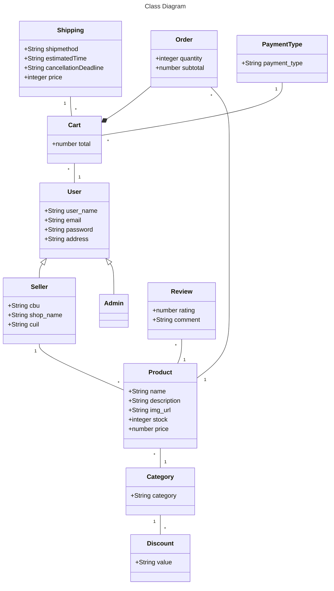

# Trabajo-Practico-Desarrollo-de-Software
## Integrantes 
|Legajo|Apellido y Nombres|
|:-|:-|
|49105|Bianchini, Tomás|

## 1. Tema
### Descripción
El proyecto consiste en el desarrollo de un sitio web de comercio electrónico que permite a los usuarios realizar la compra de productos ofrecidos por múltiples vendedores. El sitio estará diseñado para admitir diferentes niveles de usuarios, incluidos Clientes, Administradores y Vendedores, cada uno con funciones y privilegios específicos. Donde los administradores pueden crear descuentos para categorías de productos. Además, Los clientes pueden dejar reseñas y calificaciones para los productos que han comprado. Se utilizará la API de OpenAI, para moderar y analizar las reseñas, y si se detecta contenido inapropiado, la reseña será dada de baja. 
### Modelo

## 2. Alcance Funcional
#### Aprobación Directa
|Req|Detalle|
|:-|:-|
|CRUD simple|1.CRUD Shipping   2.CRUD PaymentType   3.CRUD User   4.CRUD Category|
|CRUD dependiente|1.CRUD Product   2.CRUD Discount   3.CRUD Order   4.CRUD Cart|
|Listado + detalle|1.Listado de productos filtrado por categoría => detalle de la descripcion,   precio, precio con descuento(en caso de que la categoría tenga un descuento activo), imagen del producto |
|CUU/Epic|1. Completar un carrito con productos|
### Alcance Adicional Voluntario

|Req|Detalle|
|:-|:-|
|Listado + detalle|1. Listado de carritos completados => detalle de la fecha de compra, todos los productos con la cantidad,   el tipo de envio elegido, y la posibilidad de cancelar la compra si esta dentro del tiempo permitido |
|CUU/Epic|1. Cancelar un carrito   3. Envio del carrito   4. Moderación de reviews con la api de OpenAI|
